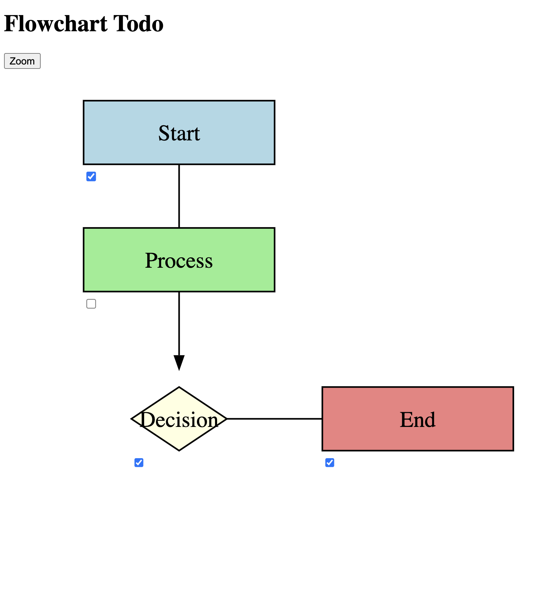

# Flowchart Todo

## :page_facing_up: Description:
By Weng Fei Fung. You've designed an SVG flowchart to outline automation or technical implementations. To enhance interactivity, you'd like to include checkboxes that can be checked off by team members or yourself as each part of the flow chart is implemented or addressed. In addition, you want to add a memo textbox where team members can comment about the flowchart.

Note this is in real-time, so when one team member makes a change to checkboxes or memo, another team member sees it without needing to refresh the page. The polling is at 4 seconds. You can change this polling if you're on a capable server.

## :open_file_folder: Table of Contents:
---
- [Description](#page_facing_up-description)
- [Screenshots](#camera-screenshots)
- [Live Demo](#computer-live-demo)
- [Installation](#minidisc-installation)
- [Usage](#runner-usage)
---

## :camera: Screenshots:

## :computer: Live Demo:
<a href="https://wengindustry.com/tools/flowchart-todos/demo" target="_blank">Check it out</a>

## :minidisc: Installation:
Run in a PHP server.

You can design your SVG flow chart on https://app.code2flow.com/ or https://miro.com/, then export as SVG. Copy the SVG code into the index.html making sure the SVG tag has viewBox and preserveAspectRatio attributes so this app can calculate the checkbox positioning.

Add data-checkbox to each SVG child you want to have a checkbox (eg. rect, path, etc)

This will create a teamspace where anyone with the URL can see the checkboxes or modify them. The memo textarea at the bottom will work out of the box.

## :runner: Usage:
Run in a PHP server. No needed hands-on setup.